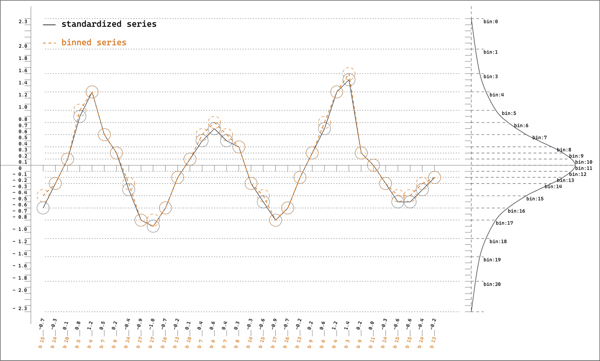

# time-series tokenization ts-tok

Welcome to the wacky world of time-series tokenization with ts-tok! 

Are you tired of boring old regression approaches to time-series forecasting? Look no further, because we've got an experimental project that will blow your mind (or at least make you scratch your head in confusion).

Introducing our Time-Series Tokenization Experiment! It's so experimental that it may not have any practical applications in the real world, but who cares about practicality when you're having fun?

Our tokenization process is like a magician's trick - we take a wild range of time-series values and transform them into a fixed vocabulary of tokens. How do we do it? With Gaussian binning, of course! We create bins that hold a fixed percentage of the total data distribution, which means smaller bins around the data mean and less reconstruction error introduced by tokenization. Sure, this approach has its limitations for data that don't fit well to Gaussians, but hey, life is all about trade-offs.


### Gaussian Binning

Bins are created such that each bin holds a fixed percentage of the total data distribution. This in turn means that the bins around the data mean is much smaller, thus this binning reduces reconstruction error introduced by tokenization.

This also means that reconstruction is wild for data that do not fit well to gaussians. This is a limitation of the approach, but we believe that this is a reasonable trade-off for the simplicity of the approach.
Gaussian Binning is implemented in tstok.tokenizer.Tokenizer


### Tokenization Process

Since values of a time-series can vary in a wild range, a transformation that converts the series into a fixed interpretable vocabulary of tokens is required, which is taken care of by the tokenization process. To ensure a fixed vocabulary for all time-series, the tokenization process used in this project involves standardizing and binning each context window seperately to create a sequence of tokens.


#### Target Tokenization
The targets are also standardized using the same parameters as the context window before being binned. This approach enables forecasting of monotonically increasing/decreasing sequences, even when the context window is not stationary.  
Also, the target at sequence position `t` is normalized using the standardization parameters from the beginning of the context window to sequence position `t-1`.
```
    example:
    context window size = 5
    sequence:               [V1, V2, V3, V4, V5, V6]

    standardized sequence:  [v1, v2, v3, v4, v5, v6]

    context window:
        [v1, v2, v3, v4, v5]                                                            --gaussian binning-->   [b1, b2, b3, b4, b5]
    target window:      
        [v2, v3, v4, v5, v6]  -- standardized --> [s(v2), s(v3), s(v4), s(v5), s(v6)]   --gaussian binning-->   [b6, b7, b8, b9, b10]
        where,
            s(v2) = [v1] - (mean([v1]) / std([v1]))
            s(v3) = [v1, v2] - (mean([v1, v2]) / std([v1, v2]))
            s(v4) = [v1, v2, v3] - (mean([v1, v2, v3]) / std([v1, v2, v3]))
            s(v5) = [v1, v2, v3, v4] - (mean([v1, v2, v3, v4]) / std([v1, v2, v3, v4]))
            s(v6) = [v1, v2, v3, v4, v5] - (mean([v1, v2, v3, v4, v5]) / std([v1, v2, v3, v4, v5]))
        
            (For getting the standardized value of value v4 in target window, it is standardized using the loc and scale parameters of [v1, v2, v3])
        
        The process of gaussian binning of target window is same as that of context window.
        This means that when the value V4 appeared in context window, it was assigned a token b4.
        And when it appeared in target window, it was assigned a token b8.
        b4 and b8 may or may not be same, depending on the stationarity of the series.

```
Targe Tokenization is implemented in tstok.data.CustomDataset


#### Prediction De-Tokenization
The predictions need to be de-tokenized to get the actual time-series value. It's done by first mapping the predicted token id to a bin, and then denormalizing the bin value using parameters of the input series.

This is how a series is tokenized for inference, and how the prediction is de-tokenized.
```
series = np.random.rand(101)

input = series[:-1]
target = series[1:] # shifted by 1

input_ids, p = tokenizer.encode(input)

target_ids = tokenizer.encode(enc, p)

predict_ids = model.generate(input_ids, max_new_tokens=20)
predictions = tokenizer.decode(predict_ids, p)

```


#### Forecasting Model

Using vanilla GPT-2 model and trainer from [Andrej Karparthy's nanoGPT repo](https://github.com/karpathy/nanoGPT), with the introduced time-series tokenization scheme that converts time-series into sequences of tokens. These tokens are then fed into the GPT model as input during training. The model is trained to predict the next token in the sequence, which is then decoded back into its corresponding time-series value.


Some forecasting results can be found in [output/](output/). The results are from a 6.5M parameters model trained on ~3000 timeseries with a total of ~3M timestamps for 1000 iterations with the following configuration:
```
model.n_embd = 128
model.n_head = 8
model.block_size = 256
model.n_layer = 8
model.dropout = 0.05
```


We hope you find our experiment intriguing and informative! Our motivations may have been driven by pure adventure-seeking impulses (who doesn't love trying something new?)
